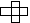
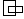
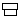
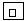

# geometry

This project is a coding exercise in basic computational geometry. 
I was asked to write code that could tell if two rectangles intersect 
(, 
, 
, ...) are adjacent 
(, 
, ...) or have a contains
relationship ().

Though the example drawings show rectangles that have the same orientation
(the edges of the rectangle are parallel or perpendicular to each other),
this was not included as a constraint in the problem statement.
Since there was nothing in the problem description that constrained the
rectangles from being rotated in different orientations, I used a
vector-based approach that does not care about the orientation of the
rectangles. 

There was also nothing in the problem description that said the rectangles
must be coplanar. I made the decision to assume that the rectangles are
coplanar to avoid the extra implementation time that implementing in three
dimensions would take. The class I wrote to model rectangles is called
`Rectangle2D`.

The algorithms used for determining whether two rectangles are intersecting,
adjacent or have a contains relationship are built on top of an algorithm to
determine if two euclidean vectors intersect or overlap. I found this
algorithm at 
[[https://stackoverflow.com/questions/563198/how-do-you-detect-where-two-line-segments-intersect]]